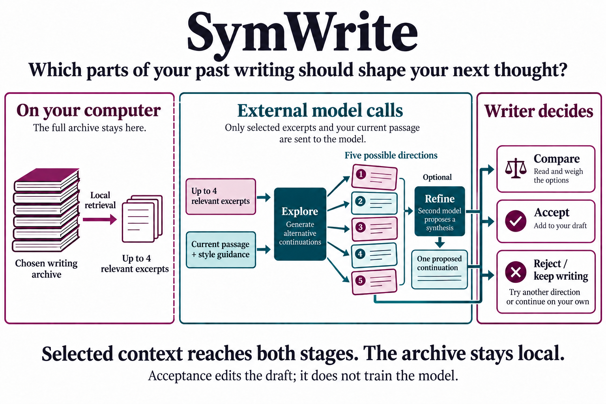

(AI-assisted writeup)

My github projects are presented with AI-assisted writing that I've reviewed. If you would like to check out my fully-human thoughts on my projects, please see my personal website [cassie.mccoy.world](https://cassie.mccoy.world)

# SymWrite

**Personal writing assistance as a problem of memory, variation, and authorship.**

A writing assistant can produce a plausible next sentence without understanding why its author would want to say it. Giving the assistant more examples of that person's writing helps with some of this problem. It also creates another one: which parts of their past work should be allowed to shape the thought they are having now?

SymWrite is a research prototype for exploring that question. It retrieves relevant passages from a writer's chosen material, generates several possible continuations, and offers a refinement alongside the alternatives. The writer can inspect the context, compare directions, and decide what enters the draft.


*The Avalon invitation is author-provided sample writing. This screenshot shows the draft before generation; it does not present an AI-written continuation as the author’s text. [Sample and capture details](docs/examples/README.md).*

## Where the decision happens

The visible decision is whether to accept a suggestion. Several consequential decisions have already happened by then. Retrieval selected a small part of the writer's archive. A model explored a set of continuations. Another model decided which ideas to carry forward.

I want those intermediate choices to remain available for inspection. SymWrite therefore treats comparison and review as part of the writing workflow. The refined suggestion remains available alongside the original candidates. Retrieved excerpts are available under **Sources**. A writer can take one direction, reject the whole set, or keep typing.



There are two ways through the loop. **Refine** produces five continuations in parallel, then asks a second model for one coherent continuation. **Explore** stops after the first stage. It is useful when the differences between possible next thoughts matter more than receiving a polished answer.

The interface keeps the draft and its possible continuations beside one another. Numbered cards expose the alternatives; selecting a card expands it for review. Documents, examples, and profile context stay available in the top navigation. The **What is this?** tab explains the pipeline without discarding the draft, cursor position, or suggestion-review state.

The writer requests each suggestion explicitly. Acceptance inserts text at the cursor and preserves the text after it. Editing the draft, moving the cursor, or dismissing a pending request invalidates its suggestion; an old response cannot quietly attach itself to a newer thought. Acceptance can be undone, and drafts are saved in the current browser.

## Memory with a visible boundary

The profile contains writing samples, explicitly approved facts, and style guidance. Samples provide evidence of how someone writes; they are not blanket permission to invent personal experiences in that voice.

The default retrieval path embeds the selected material locally and keeps a reusable index on the computer. For each request, it chooses up to four excerpts under a shared context budget. Those excerpts reach **both** the candidate and refinement stages. The source list in the interface shows the context that was sent, rather than a separate search result that played no part in generation.

Generation uses external model providers. Nearby draft text, style guidance, and selected excerpts are sent when the writer requests a continuation; the entire archive is not sent. The current example profile uses Qwen for candidates and DeepSeek for refinement through OpenRouter. Each stage has its own provider and model setting, and Groq is also supported. Provider credentials stay on the server.

Local mode supports a personal writing profile. A separately configured public beta serves only the author-approved example profile. In both cases, drafts remain in the current browser; signing in unlocks suggestions without creating a cloud document archive. Markdown export provides a portable copy.

## A trial with a boundary

A visitor can request ten continuations before signing in. A verified Google account then receives ten per day. Each continuation includes the whole exploration-and-refinement loop, so the visible allowance corresponds to the writer's action. Started requests count even when cancelled: the model may already be working.

The server reserves one allowance before starting generation. A verified session and bot challenge guard that request; the remaining trial or daily allowance determines whether it can proceed.

The allowance lives on the server. Clearing browser storage does not reset the network's trial; simultaneous requests cannot reuse the same remaining credit. A shared daily ceiling and a separate provider key with a spending cap limit the cost of the beta. These are practical constraints, not a claim that anonymous visitors can be identified perfectly. Shared networks can reach a limit together.

The public flow requires configured Google sign-in, bot verification, HTTPS, persistent usage storage, and a capped app key. An incomplete public configuration refuses to start. The [public beta notes](docs/PUBLIC_BETA.md) explain those boundaries and the remaining deployment steps.

## From a first draft to a second

The current sample is an invitation to Avalon: revelry, sonnets, dancing, costumes, and a presentation of memorized monologues around 9:30. The revision note adds a fiddle and a duel. The second draft begins:

> WELCOME ONE AND ALL TO AVALON!

The first draft gives the assistant an example of the writer's voice and the practical details that should survive revision. The note supplies the change the writer wants to make. The unfinished second draft establishes where the next words belong. Keeping those roles visible makes it possible to examine whether assistance carries the intention forward or merely produces a plausible invitation.

The starter preserves the supplied writing and stops at that opening. It is available under **Examples → An invitation to Avalon**. No continuation has been generated for this capture. [Earlier live generation records](docs/examples/README.md#earlier-generation-records) remain available as historical tests of the writing workflow.

## What I would still like to understand

The part of the architecture I find most useful is the separation between exploring a thought and choosing its expression. It gives the writer something to compare. That is a stronger starting point for studying collaboration than a single fluent suggestion whose alternatives are invisible.

It is still a hypothesis about a better interaction. A candidate ensemble can repeat the same assumption five times. Refinement can remove a qualification that mattered. A retrieved source can be relevant to the topic and wrong for the present argument. Showing context makes these choices easier to examine; it does not establish that a suggestion faithfully represents its author.

The next useful work would be an evaluation of those failure modes: compare a single continuation with the candidate-and-refinement workflow, measure what writers revise after acceptance, and test whether source inspection helps them notice unsupported claims. I would also like retrieval to distinguish an abandoned position from a current one, and to make the effects of time, genre, and context easier to control.

## Run it locally

Use Python 3.11. From the repository root:

```bash
python3.11 -m venv .venv
source .venv/bin/activate
pip install -r symwrite-app/requirements.txt
cp .env.example .env
```

Add `OPENROUTER_API_KEY` to `.env`, then run:

```bash
python symwrite-app/run.py
```

Open **http://127.0.0.1:8001**. The first start downloads a small local embedding model. The editor starts blank. The author-provided Avalon invitation is available under **Examples**, alongside its writing reference and revision details. Local generation also observes the ten-request trial; optional Google credentials unlock the daily allowance. Without an API key, the editor still opens, but generation reports that it is unavailable; it never substitutes canned prose for a live response.

See [setup, personal profiles, and verification](docs/DEVELOPMENT.md) for private writing imports, provider changes, the download-free retrieval option, and tests.

---

The original prototype dates to September 2025. The September 2026 restoration connects retrieval to generation, repairs provider handling and draft persistence, and replaces the experimental onboarding pipeline with explicit, portable writing profiles. [Restoration notes](docs/RESTORATION.md) distinguish that work from the original design.

This public repository begins with a reviewed source snapshot. Original development history and private writing profiles remain private. The included Avalon material is author-approved; the other documented generation examples use fictional writing.
