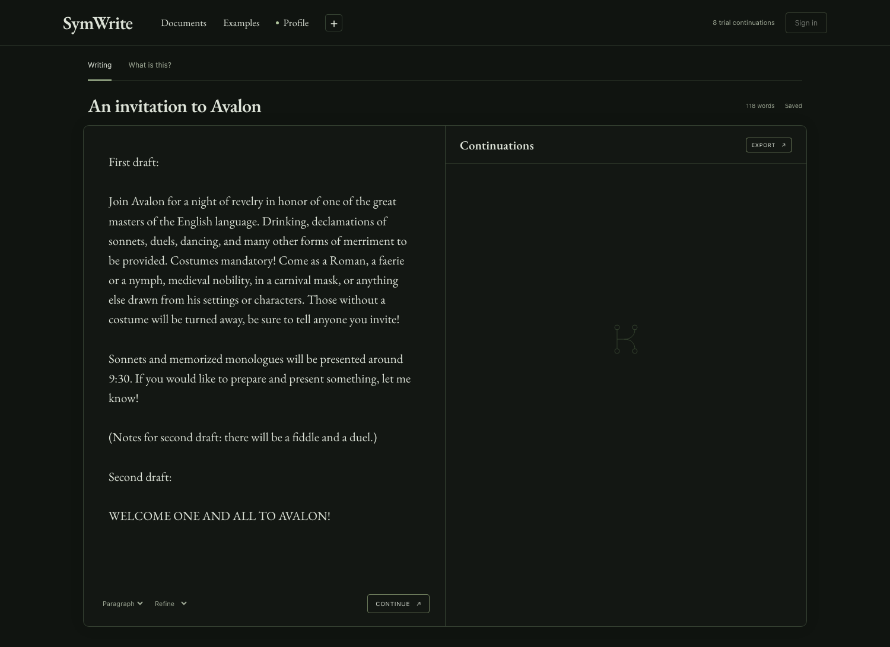
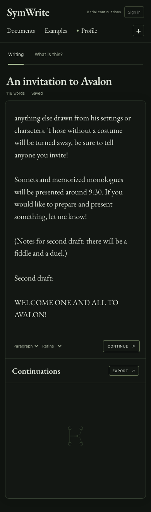

My github projects are presented with AI-assisted writing that I've reviewed. If you would like to check out my fully-human thoughts on my projects, please see my personal website [cassie.mccoy.world](https://cassie.mccoy.world)

# The Avalon writing sample

The current example uses the author-provided invitation in [avalon-input.txt](avalon-input.txt), with the first draft, the note that there will be a fiddle and a duel, and the second-draft opening **WELCOME ONE AND ALL TO AVALON!** The wording is preserved; the draft labels and spacing are formatted for the editor.

The retrieval profile contains that first draft as a writing reference, the revision note, and the costume and presentation details extracted from the invitation. Its style guidance asks for an exuberant, theatrical invitation while preserving the stated logistics. It does not authorize invented dates, addresses, prices or RSVP deadlines.

These screenshots show the actual local editor **before generation**. No model call was made for the Avalon capture, and no generated continuation is implied. The sample is author-provided, not fictional or AI-written.

## Narrow-screen layout

## Earlier generation records

The previous fictional research notebook was used for live OpenRouter checks on 2026-09-23. Those records remain as historical evidence; they are no longer the current app sample. Each completed with five Qwen candidates and one DeepSeek refinement using local semantic retrieval.

| Former example | Observed request time | Full record |
| --- | ---: | --- |
| Where the decision happens | 29.5 s | [agency.json](agency.json) |
| The shape of a memory | 30.9 s | [memory.json](memory.json) |
| What acceptance can tell us | 10.1 s | [evaluation.json](evaluation.json) |

These are individual local requests with a warm embedding cache, not a controlled benchmark or latency guarantee. One earlier capture attempt had a failed candidate and was retried. The records preserve their actual input, output, retrieved excerpts, model names and timestamps; they have not been relabeled as Avalon sessions. The existing `summary.json` describes those historical requests.
